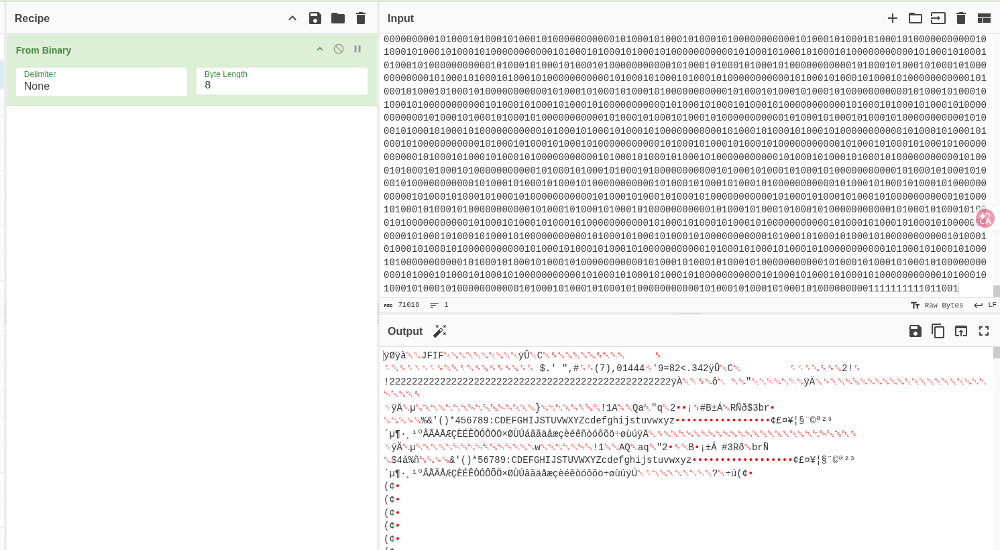
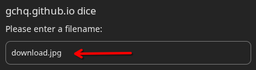
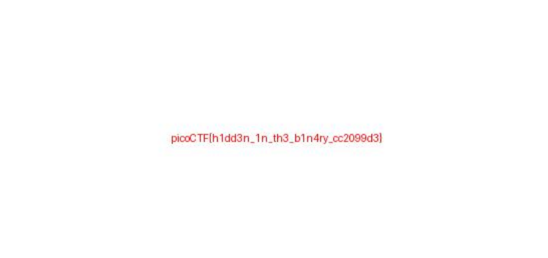
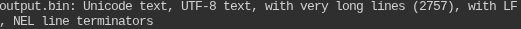

# Binary Digits

Enunciado:

> This file doesn't look like much... just a bunch of 1s and 0s. But maybe it's not just random noise. Can you recover anything meaningful from this?

Opciones a tomar:

- Al ser un archivo `.bin`​ podermos hacer un `cat`​ para verificar su contenido (que serían muchos bits de `0`​ y `1`s)
- Si pensamos en que hay algún mensaje en dicho archivo, tenemos que recordar algunas cosas:

  - ASCII: Este sistema de codificación cuenta con 256 carácteres en su versión extendida, y cada una esta compuesta por 8 bits.
  - Podemos separar el contendo en cadenas d 8 bits para luego traducirlas y ver los carácteres y si hay algún mensaje dentro.

---

Para ejecutar todo esto de manera fácil podemos emplear la herramienta `CyberCheh`, que nos permitirá encriptar, desencriptar, manipular los datos de un archivo como queramos.

Para ello, copiamos el contenido del archivo `.bin`​ en el `input` del panel.

Luego debemos de emplear la operación `From Binary` que nos pertmite tomar una secuencia de ceros y unos y la traduce a texto legible. Entre sus atributos tenemos:

- `Delimiter`: Define cada carácter que se utiliza para separar un bloque de binario de otro dentro de la cadena de entrada.  
  Es decir, cada cuantos bits habrá un caracter que separará al arcchivo binario en cadenas de igual tamaño.  
  Puede ser todo seguido (None), separado por un espacio (Space), u otras opciones como saltos de línea, comas u otros caracteres especiales.
- `Byte Length`: es la longitud de estas cadenas; especifica de cuantos 1y 0 están conformadas las cadenas, donde estas representan un solo carácter.  
  Para nuestro caso como es un reto básico debemos de analizar cada 8 bits ya que así tenemos como salida carácteres del código ASCII.

---



En el resultado vemos muchos caracteres basura que no significaa nada si no se evalua de otra forma. Para ello le damos a guardar el contenido en un archivo,.




Y ahí está, el archivo que descarguemos nos aparece en formato `.jpg` lo que nos dice que es una imagen.

Para confirmar lo último, ejecutamos un `file`​ para saber con seguridad el tipo de archivo que tenemos, en este caso lo nombramos `resultado.bin` ya que viene de un binario.

```shell
alonzzo_finn@parrot]─[~/Desktop/Pico_Gym/Forensics/Binary_digits]
└──╼ $file resultado.bin
resultado.bin: JPEG image data, JFIF standard 1.01, aspect ratio, density 1x1, 
segment length 16,baseline, precision 8, 800x500, components 3
```

Y el resultado lo confirma, es una imagen.

Si aun no estamos seguros de lo que tenemos podemos inspeccionar en los primeros bits del archivo `.bin` para verificar el formato:

```shell
user:~$ head -c 50 digits.bin
Output: 11111111110110001111111111100000000000000001000001

# Al pasar los primetos 32 bits separandolos de 8 en 8 tenemos:

11111111 11011000 11111111 11100000 

# Que al pasarlo a base 16 tenemos : FF D8 FF E0
```

Los creadores del formato `JPEG`​ establecieron por estádar que todo archivo `JPEG`​ válido<span data-type="text" style="color: var(--b3-font-color11);"> </span>**debe comenzar obligatoriamente**<span data-type="text" style="color: var(--b3-font-color11);"> </span>con los bytes hexadecimales `FF D8 FF`​.  
Cuando el comando `file`​ lee esos 3 primeros bytes, sabe de inmediato que está frente a una imagen `JPEG`.

---

Luego, al ejecutar un `xdg-open` a este archivo nos muestra la siguiente imagen:



Esto mostrándonos la flag del reto: `picoCTF{h1dd3n_1n_th3_b1n4ry_cc2099d30}`

---

##### Otra forma de resolverlo

En vez de emplear CyberChef, que no esta mal, podemos elaborar un código en python que lea el achivo `.bin`​, identifique espacios, líneas de salto; las pueda elimiar y solo quedarnos con el contenido.  
Luego podemos hacer que se evalue el archivo en cadenas de 8 carácteres y los traduzca a ASCII.  
Finalmente se guarda en un nuevo archivo que llamaremos `resultado.bin`.

```python
with open("file.bin", "r") as f:
    bits = f.read().replace(" ", "").strip()

byte_data = bytes(int(bits[i : i + 8], 2) for i in range(0, len(bits), 8))

with open("output.bin", "wb") as f:
    f.write(byte_data)
```

##### Explicaión del código:

- `with`​: Es una sentencia que se encarga de los recursos que se quieran emplear en un código. Este los **cierra o libera** **de manera garantizada** una vez que se terminen de usarlos, **incluso** si ocurren **errores** o **excepciones** dentro del blooque de código.
- `open`​: Abre un archivo que se encuentre en el directorio de trabajo. La opción `r`​ indica que el programa leerá el contenido que tenga en **texto plano**. El argumento `as`​ solo se la asigna a la variable `f`.
- `f.read`: Lee todo el contenido del archivo de golpe y lo devuelve como una sola cadena de texto (strings).
- `.replace(" ","")`​: Es un métodod e cadenas de texto. Busca todos los espacio en blanco " " dentro del texto leído y los **elimina** (los remplaza por nada `""`​).  
  Es decir, si tuvieramos `001 0111 11`​, la salida sería así `001011111`.
- `.strip()`​: Elimina los espacios en blanco, tabulaciones o **saltos de línea** (`\n`​\) que queden sueltos al mero incio o al final de todo el archivo.
- `bits=`: es la variable donde se vana a guardar todos estos cambios
- `len(bits)`​: Cuenta cuántos carácteres (`0`​ y `1`) tiene la cadena en total.
- `range(0, len(bits), 8)`​: Genera una secuencia de números empezando desde el `0`​ hasta la cantidad de caracteres leída por el `len()`, todo esto avazando de 8 en 8.
- `bits[i : i+8]`​: Es un **slicing** (recorte) de texto. Lo que hace es tomar un fragmento de la cadena desde la posición `i`​ hsata la `i+8`​. Esto se repetirá con el bucle `for`.
- `int(..., 2)`​: La función `int()`​ **convierte texto a número**. El segundo argumento `2`​ le indica a python que el texto esta en base 2 (bianrio). De esta manera, convierte  
  ​`01011100`​ en el número correspondiente `92`.
- `bytes(...)`​: Toma esa lista de números enteros y los convierte en un objeto de **bytes reales** de python. Cada entero se tranforma en un byte físico de almacenamiento.  
  Solo vea algunos de los primeros elementos de esta variables:  
  ​`b'\xff\xd8\xff\xe0\x00\x10JFIF\x00\x01\x01\x00\x00\x01\x00\x01\x00...`​  
  El `b`​ que antecede el contenido señala que es una secuencia de **bytes puros**.
- `open(..., "wb")`​: Abre el archivo output.bin (lo crea en caso no exista) y el modo `wb`​ que significa **Escritura Binaria** (**Write Binary**). Es decir, aquí sí se van a guardar datos bianrios puros, no texto.
- `f.write(byte_data)`​: TOma los bytes reales que fabricamos en el paso anterior y los escribe directamente en el disco duro dentro de `output.bin`.

---

En caso tenga facilidad de ejecutar dicho scrip por la terminal de linux puedo hcaerlo de la siguiente manera:

```bash
python3 -c 'bits=open("file.bin").read().replace(" ","").strip(); open("resultado.bin","wb").write(bytes(int(bits[i:i+8],2) for i in range(0,len(bits),8)))'
```

Luego, después de obtener el último archivo mostraá el mismo formato `JPEG`​ confirmando con `file`

---

##### Errores en el proceso

Si cometemos el error de copiar el contenido del output de `CyberChef`​ notaremos que al crear un archivo nuevo y pegarle este; el tipo de archivo será distinto al de un formato `JPEG`.

`CyberChef`​ logró interpretar esos bytes binarios como letras o simbolos, por ello es que vimos que el archivo descargado tenía formaro `.jpg`​.  
El problema viene que como una imagen contiene bytes que no corresponden a letras legibles (carácteres no imprimibles o de control), <u>el navegador y el portapapeles</u> **intentaron traducirlos a símbolos Unicode/UTF-8**.

Veamos lo que señala el comando `file`:



#### **Regla de oro en Forensics:**

**Nunca uses editores**  de texto como `nano`​, `vim`​ o `notepad`​ para crear, copiar o guardar archivos binarios (imágenes, comprimidos, ejecutables). Siempre debes manejarlos desde scripts en modo escritura binaria (`wb`) o herramientas de redirección en la terminal.

---

##### Comandos empleados en la terminal

- `file`​: Analiza la **cabecera** y estructura interna de un archivo para **determinar su tipo real**, <u>sin importar que extensión tenga su nombre</u>.
- `head`: sirve para mostar el inicio de un archivo o de una secuencia de datos en la terminal. Por defecto, imprime las primeras 10 líneas.
- `xdg-open`​: abre cualquier archivo o URL utilizando la **aplicación predeterminada** configurada en el sistema según su tipo MIME.  
  Ejem:

  - `xdg-open https://google.com`     ---> Abre el navegador predeterminado, ya sea Chrome, Firefox, etc.
  - `xdg-open docuemento.pdf`     ---> Abre el visor de pdf predetermindo como adobe, okular, entre otros.
- `python3`​: Ejecuta un script que se adjunto en un archivo `.py` o de manera manual digitada en la línea de comandos.

---

##### Datos importantes

- `CyberChef`​ ejecuta de manera eficiente la salida del contenido y lo trata como un archivo descargable en caso se trate de algún formato específico (como en este ejemplo `.jpg`).
- `b'...'`​: Señala que el contenido de la varible definida cuenta con **bytes puros**.
- No se debe de usar editores de texto para tratar con datos en bianrio. Estas pueden alterar el significado original de un contenido al causar una traducción de caracteres bianrios a Unicode UTF-8.
- Es mejor siempre usar códigos que manejen datos en binarios puros.
- Cada formato de archivo tiene una cabecera de bytes que lo identifican, como el  
  ​`FF D8 FF`​ del formato `JPEG`.

‍
