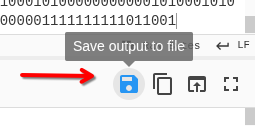

# Binary Digits

## Información del reto

- **Plataforma:** PicoCTF
- **Categoría:** Forensics
- **Reto:** Binary Digits

## Enunciado

> This file doesn't look like much... just a bunch of 1s and 0s. But maybe it's not just random noise. Can you recover anything meaningful from this?

## Opciones a tomar

- Al ser un archivo `.bin` podemos hacer un `cat` para verificar su contenido (que serían muchos bits de `0` y `1`).
- Si pensamos en que hay algún mensaje en dicho archivo, tenemos que recordar algunas cosas:

  - **ASCII estándar:** utiliza 7 bits y puede representar **128 valores** (`0–127`). Existe una versión extendida de 8 bits que se suele denominar "extended ASCII", pero no constituye un estándar único y universal de 256 caracteres. En este reto, además, estamos trabajando con **bytes de 8 bits**, que pueden representar 256 valores (`0–255`).
  - Podemos separar el contenido en cadenas de 8 bits para luego traducirlas y ver los caracteres y si hay algún mensaje dentro.

---

Para ejecutar todo esto de manera fácil podemos emplear la herramienta `CyberChef`, que nos permitirá codificar, decodificar y manipular los datos de un archivo de distintas formas.

Para ello, copiamos el contenido del archivo `.bin` en el `input` del panel.

Luego debemos emplear la operación `From Binary`, que nos permite tomar una secuencia de ceros y unos y convertirla a los bytes correspondientes. Entre sus atributos tenemos:

- `Delimiter`: Define el carácter o separador que se utiliza para separar un bloque de binario de otro dentro de la cadena de entrada. Es decir, cómo se separan los bloques de bits. Puede ser todo seguido (`None`), separado por un espacio (`Space`), u otras opciones como saltos de línea, comas u otros caracteres especiales.
- `Byte Length`: Es la longitud de estas cadenas; especifica de cuántos `1` y `0` están conformadas las cadenas, donde cada cadena representa un byte. Para nuestro caso, como es un reto básico, debemos analizar cada 8 bits, ya que así obtenemos bytes que posteriormente podemos interpretar según el formato de los datos.

---

<p align="center">
  
</p>

En el resultado vemos muchos caracteres que no significan nada si no se evalúan de otra forma. Para ello le damos a guardar el contenido en un archivo.

<p align="center">
  
</p>

<p align="center">
  
</p>

Y ahí está: el archivo que descarguemos nos aparece en formato `.jpg`, lo que nos indica que los datos corresponden a una imagen.

Para confirmar lo último, ejecutamos `file` para saber con seguridad el tipo de archivo que tenemos. En este caso lo nombramos `resultado.bin` ya que viene de un binario.

```bash
[alonzzo_finn@parrot]─[~/Desktop/Pico_Gym/Forensics/Binary_digits]
└──╼ $ file resultado.bin
resultado.bin: JPEG image data, JFIF standard 1.01, aspect ratio, density 1x1,
segment length 16, baseline, precision 8, 800x500, components 3
```

Y el resultado lo confirma: es una imagen.

Si aún no estamos seguros de lo que tenemos, podemos inspeccionar los primeros bits del archivo `.bin` para verificar el formato:

```bash
user:~$ head -c 50 digits.bin
Output: 11111111110110001111111111100000000000000001000001
```

Al pasar los primeros 32 bits, separándolos de 8 en 8, tenemos:

```text
11111111 11011000 11111111 11100000
```

Que al pasarlo a base 16 tenemos:

```text
FF D8 FF E0
```

Los creadores del formato `JPEG` establecieron por estándar que todo archivo `JPEG` válido debe comenzar con los bytes hexadecimales `FF D8 FF`.

Cuando el comando `file` lee esos primeros bytes, puede identificar que los datos son compatibles con una imagen `JPEG`.

---

Luego, al ejecutar un `xdg-open` a este archivo, nos muestra la siguiente imagen:

<p align="center">
  
</p>

Esto nos muestra la flag del reto:

```text
picoCTF{h1dd3n_1n_th3_b1n4ry_cc2099d30}
```

---

## Otra forma de resolverlo

En vez de emplear CyberChef, que no está mal, podemos elaborar un código en Python que lea el archivo `.bin`, identifique espacios y saltos de línea, los pueda eliminar y nos permita quedarnos solo con el contenido.

Luego podemos hacer que se evalúe el archivo en cadenas de 8 caracteres y convertir cada cadena binaria a su correspondiente valor de byte.

Finalmente, se guarda en un nuevo archivo que llamaremos `resultado.bin`.

```python
with open("file.bin", "r") as f:
    bits = f.read().replace(" ", "").strip()

byte_data = bytes(int(bits[i : i + 8], 2) for i in range(0, len(bits), 8))

with open("output.bin", "wb") as f:
    f.write(byte_data)
```

### Explicación del código

- `with`: Es una sentencia que se encarga de los recursos que se quieran emplear en un código. Estos se **cierran o liberan de manera garantizada** una vez que se terminan de usar, **incluso** si ocurren **errores** o **excepciones** dentro del bloque de código.
- `open`: Abre un archivo que se encuentre en el directorio de trabajo. La opción `r` indica que el programa leerá el contenido en **texto plano**. La expresión `as f` asigna el archivo abierto a la variable `f`.
- `f.read`: Lee todo el contenido del archivo de golpe y lo devuelve como una sola cadena de texto (*string*).
- `.replace(" ", "")`: Es un método de cadenas de texto. Busca todos los espacios `" "` dentro del texto leído y los **elimina** (los reemplaza por nada `""`).

  Es decir, si tuviéramos:

  ```text
  001 0111 11
  ```

  la salida sería:

  ```text
  001011111
  ```

- `.strip()`: Elimina espacios en blanco, tabulaciones o **saltos de línea** (`\n`) que queden sueltos al mero inicio o al final de todo el archivo.
- `bits =`: Es la variable donde se van a guardar todos estos cambios.
- `len(bits)`: Cuenta cuántos caracteres (`0` y `1`) tiene la cadena en total.
- `range(0, len(bits), 8)`: Genera una secuencia de números empezando desde `0` hasta la cantidad de caracteres leída por `len()`, avanzando de 8 en 8.
- `bits[i : i+8]`: Es un **slicing** (recorte) de texto. Lo que hace es tomar un fragmento de la cadena desde la posición `i` hasta `i+8`. Esto se repetirá con el bucle `for`.
- `int(..., 2)`: La función `int()` **convierte texto a número**. El segundo argumento `2` le indica a Python que el texto está en base 2 (**binario**). De esta manera, convierte:

  ```text
  01011100
  ```

  en el número correspondiente:

  ```text
  92
  ```

- `bytes(...)`: Toma los valores enteros y los convierte en un objeto de **bytes reales de Python**. Cada entero se transforma en un byte. Solo veamos algunos de los primeros elementos de esta variable:

  ```python
  b'\xff\xd8\xff\xe0\x00\x10JFIF\x00\x01\x01\x00\x00\x01\x00\x01\x00...'
  ```

  La `b` que antecede el contenido señala que es una secuencia de **bytes puros**.
- `open(..., "wb")`: Abre el archivo `output.bin` (lo crea en caso de que no exista) y el modo `wb` significa **Escritura Binaria** (**Write Binary**). Es decir, aquí sí se van a guardar datos binarios puros, no texto.
- `f.write(byte_data)`: Toma los bytes reales que fabricamos en el paso anterior y los escribe directamente en el archivo `output.bin`.

---

En caso de tener facilidad para ejecutar dicho script por la terminal de Linux, puedo hacerlo de la siguiente manera:

```bash
python3 -c 'bits=open("file.bin").read().replace(" ","").strip(); open("resultado.bin","wb").write(bytes(int(bits[i:i+8],2) for i in range(0,len(bits),8)))'
```

Luego, después de obtener el último archivo, mostrará el mismo formato `JPEG`, confirmándolo con `file`:

```bash
file resultado.bin
```

---

## ⚠️ Errores en el proceso

Si cometemos el error de copiar el contenido del *output* de `CyberChef`, notaremos que al crear un archivo nuevo y pegarlo, el tipo de archivo será distinto al de un formato `JPEG`.

`CyberChef` puede mostrar o interpretar los bytes resultantes de una operación como caracteres cuando la salida se visualiza como texto. Si esos bytes se copian desde el navegador y se pegan en otro lugar, el **navegador y el portapapeles pueden intentar tratar esos datos como texto Unicode/UTF-8**, alterando bytes que no representan caracteres de texto válidos.

Veamos lo que señala el comando `file`:

<p align="center">
  
</p>

### **Regla de oro en Forensics:**

**Nunca uses editores** de texto como `nano`, `vim` o `notepad` para crear, copiar o guardar archivos binarios (imágenes, comprimidos, ejecutables). Siempre debes manejarlos desde scripts en modo escritura binaria (`wb`) o herramientas que preserven los bytes originales.

---

## Comandos empleados en la terminal

- `file`: Analiza la **cabecera** y estructura interna de un archivo para **determinar su tipo real**, sin importar qué extensión tenga su nombre.
- `head`: Sirve para mostrar el inicio de un archivo o de una secuencia de datos en la terminal. Por defecto, imprime las primeras 10 líneas. Con `-c 50`, como en este reto, muestra los primeros 50 bytes.
- `xdg-open`: Abre cualquier archivo o URL utilizando la **aplicación predeterminada** configurada en el sistema según su tipo MIME.

  Ejemplos:

  - `xdg-open https://google.com` → Abre el navegador predeterminado, ya sea Chrome, Firefox, etc.
  - `xdg-open documento.pdf` → Abre el visor de PDF predeterminado, como Adobe, Okular, entre otros.
- `python3`: Ejecuta un script que se adjunta en un archivo `.py` o de manera manual digitada en la línea de comandos.

---

## Datos importantes

- `CyberChef` ejecuta de manera eficiente la salida del contenido y puede tratarla como un archivo descargable en caso de que los bytes resultantes correspondan a algún formato específico (como en este ejemplo `.jpg`).
- `b'...'`: Señala que el contenido de la variable definida cuenta con **bytes puros**.
- No se deben usar editores de texto para tratar con datos en binario. Estos pueden alterar el contenido original al causar una interpretación de los bytes como texto Unicode/UTF-8.
- Es mejor siempre usar código que maneje datos binarios puros.
- Cada formato de archivo puede tener una cabecera o *magic bytes* que ayudan a identificarlo, como el `FF D8 FF` del formato `JPEG`.

---

## Conceptos clave

- **Bit:** unidad básica de información que puede tomar el valor `0` o `1`.
- **Byte:** conjunto de 8 bits.
- **ASCII:** el estándar ASCII original utiliza 7 bits y define 128 valores (`0–127`).
- **Binario:** representación de información mediante bits.
- **Magic bytes:** bytes característicos que ayudan a identificar el formato real de determinados archivos.
- **JPEG:** formato de imagen cuya firma inicial típica es `FF D8 FF`.
- **`file`:** utilidad de Linux que ayuda a identificar el tipo de un archivo a partir de su contenido.
- **Python `bytes`:** objeto utilizado para representar una secuencia de bytes.
- **Modo `wb`:** modo de apertura de archivos de Python para escritura binaria.
- **Forense digital:** análisis de evidencias digitales para obtener e interpretar información sin alterar innecesariamente los datos originales.

---

## 🚩 Flag

```text
picoCTF{h1dd3n_1n_th3_b1n4ry_cc2099d30}
```
